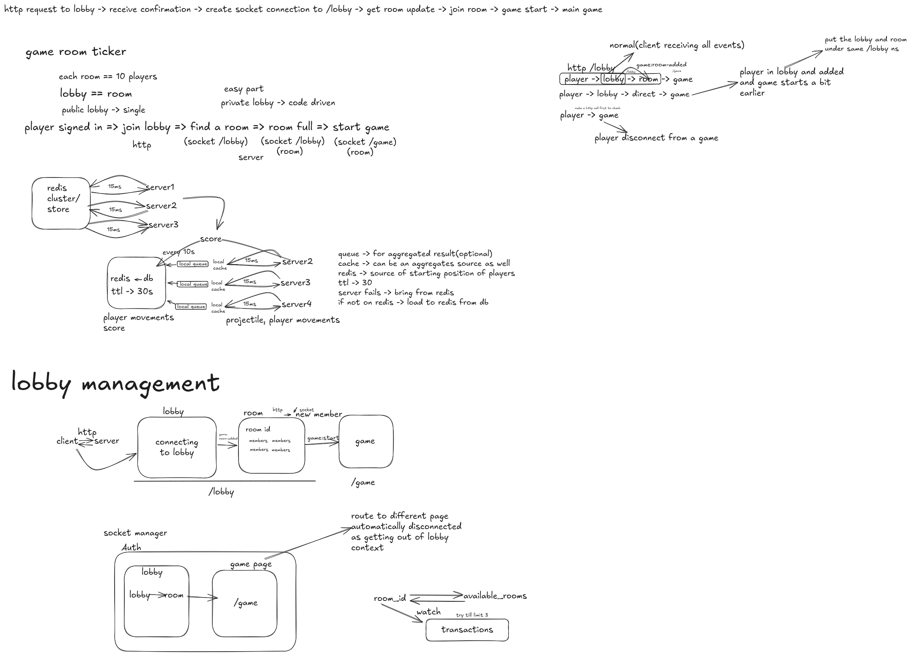

### About
I am calling it particles-io.
Just a normal 2d shooting game for exploring canvas and server driven events and real challenges of realtime(inspired by a video from youtube)

Using gsap for animation -> as it provides more granular control over the values and not dom focused like framer motion

### Whole flow

### From Canvas side(Single Player mode)
[x] Creating players

[x] Shoot Projectiles

[x] Creating enemies

[x] Detect Collsion on enemy/projectile hit
 
[x] Detect Collsion on enemy/player hit

[x] Adding colorizing to the objects

[x] Shrinking enemy size on hits

[x] Creating particle effects on hit

[x] Adding effect for projectile for shooting with projectile motion. The more we held the mouse the more distance or motion it gonna travel like archer games

[] Adding showing trajectory to see the shooting position

[x] Making the player movement snappy. Update the logic of adding player -> updating the position of prev player and having a tweening between prev and current position

### Multiplayer
[x] Creating multiple players

[x] Lobby

[x] Showing each player scores

### May be later implementing(easy things)
[] rate limit movements + suspicious activity -> having a cache with calculating the movements

[] calculating next movements based on ping + sequence

[] saving color in the db

### Deployment plans
[] Infra type code -> aws cdk(free tier)
    
    [] A single ec2 compute for server
    [] Ec2 + ecs for redis and postgres each
    [] cloud discovery for private dns in front of the ecs

[] Improvement plan

    [] Fargate with network load balancer
    [] Attaching volume
    [] Auto scaling
    [] using a load balancer in front of the ecs

[] main access -> render + upstash + netlify + supabase

### How game engine is working in frontend?
Basically it is taking items and drawing on canvas at every interval.
* Thats why canvas is getting cleared before drawing any thing
* Thats having old objects in the state is not producing good movements
* Thats why when receiving updates from server first reconsile with the player and projectile present and update their position instead of adding new again

### How fillRect is working and giving the fading effect
Does fillRect Apply to Previous Frames or the Whole Canvas?
fillRect(0, 0, width, height) applies to the whole canvas, not just the previous frames.

However, since it uses a semi-transparent color (rgba(255,255,255,0.1)), it affects the previous frames indirectly by gradually covering them instead of instantly erasing them.

How It Works in Each Frame?
Suppose we want to paint a whitish layer
Every time render() runs:
1. The canvas paints a semi-transparent white layer (fillRect).

2. This slightly brightens the entire canvas, including past drawings.

3. New objects are drawn on top.

4. Over time, older objects fade into the background because they get layered with more white overlays.

